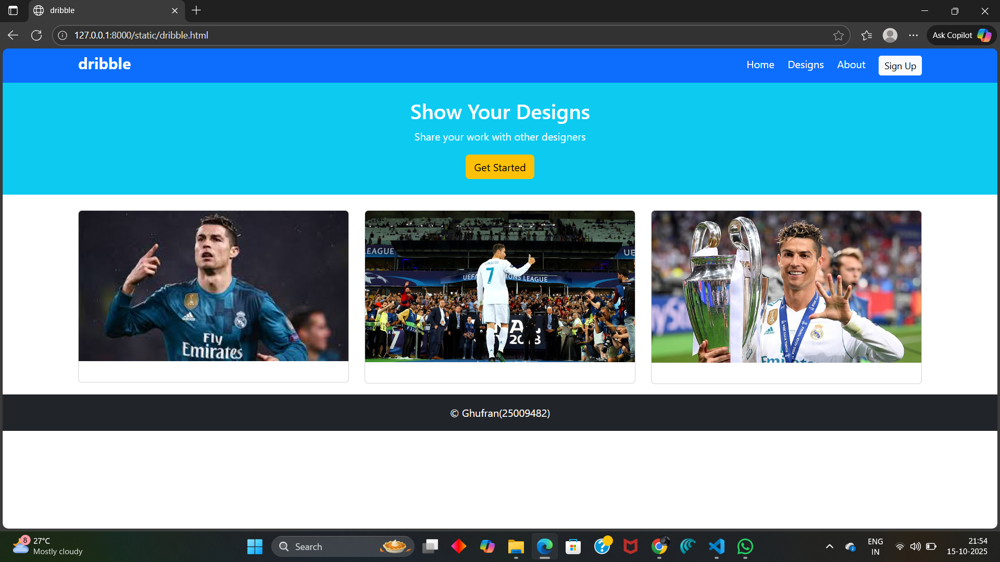

# Project Responsive Web Design using Bootstrap
## Date:15/10/2025

## AIM:
To create a simplified clone of Dribbble (https://dribbble.com/) landing page.


## DESIGN STEPS:

### Step 1:
Clone the repository from GitHub.

### Step 2:
Create Django Admin project.

### Step 3:
Create a New App under the Django Admin project.

### Step 4:
Insert the necessary CSS and JavaScript files as external in order to use Bootstrap.

### Step 5:
Create a HTML file and include the needed Bootstrap components.

### Step 6:
Publish the website in the LocalHost.

## PROGRAM :
```
<!DOCTYPE html>
<html lang="en">
<head>
  <title>dribble</title>
  <meta charset="utf-8">
  <meta name="viewport" content="width=device-width, initial-scale=1">
  <link href="https://cdn.jsdelivr.net/npm/bootstrap@5.3.3/dist/css/bootstrap.min.css" rel="stylesheet">
</head>
<body>

<nav class="navbar bg-primary text-white">
  <div class="container">
    <h4 class="fw-bold">dribble</h4>
    <div>
      <span class="me-3">Home</span>
      <span class="me-3">Designs</span>
      <span class="me-3">About</span>
      <button class="btn btn-light btn-sm">Sign Up</button>
    </div>
  </div>
</nav>

<div class="bg-info text-white text-center py-4">
  <h2>Show Your Designs</h2>
  <p>Share your work with other designers</p>
  <button class="btn btn-warning">Get Started</button>
</div>

<div class="container mt-4">
  <div class="row">
    <div class="col-md-4 mb-3">
      <div class="card">
        
        <div class="card-body">
        </div>
      </div>
    </div>
    <div class="col-md-4 mb-3">
      <div class="card">
        
        <div class="card-body"> 
        </div>
      </div>
    </div>
    <div class="col-md-4 mb-3">
      <div class="card">
        
        <div class="card-body">
        </div>
      </div>
    </div>
  </div>
  </div>

  <footer class="bg-dark text-white text-center mt-auto py-3">
    &copy; Ghufran(25009482)
  </footer>   

</body>
</html>
```

## OUTPUT:


## RESULT:
The Project for responsive web design using Bootstrap is completed successfully.
